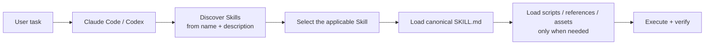
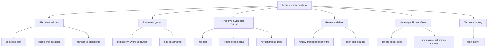
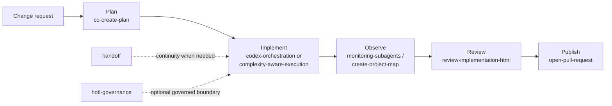

# Agent Engineering Skills

A curated catalog of **independent, reusable Skills for coding agents**.
Each Skill packages a repeatable engineering workflow—planning, execution control, review, handoff, governance, visualization, or delivery—without turning the repository into one monolithic agent persona.

> Start with the job you need done, pick the smallest applicable Skill, and load deeper instructions only when that Skill is actually used.

## How Skills fit into an agent workflow

A Skill is more than a prompt snippet. The host first discovers a Skill from its small metadata surface, then loads the canonical `SKILL.md` and only the supporting resources needed for that task.



This keeps the default context small while still allowing a Skill to carry detailed procedures, automation, references, and evaluations.

## What this repository is for

The catalog focuses on engineering workflows that are useful across repositories:



The diagram is a **capability map, not a mandatory execution order**. Skills remain independently installable and should only be composed when their contracts actually apply.

## Choose a Skill by job

| I need to… | Start with |
|---|---|
| have Claude Code and Codex jointly produce an evidence-backed plan | [`co-create-plan`](skills/co-create-plan/README.md) |
| let Claude remain requirements owner while Codex performs a sizeable implementation | [`codex-orchestration`](skills/codex-orchestration/README.md) |
| right-size investigation and verification effort for a coding task | [`complexity-aware-execution`](skills/complexity-aware-execution/README.md) |
| visualize architecture, dependencies, implementation state, or module relationships | [`create-project-map`](skills/create-project-map/README.md) |
| preserve a long-running task across a fresh session or chat | [`handoff`](skills/handoff/README.md) |
| add evidence-gated, provenance-aware execution controls | [`hotl-governance`](skills/hotl-governance/README.md) |
| see which concurrent subagents are active, blocked, stale, or done | [`monitoring-subagents`](skills/monitoring-subagents/README.md) |
| turn a completed implementation into a visual review artifact | [`review-implementation-html`](skills/review-implementation-html/README.md) |
| publish a completed, verified branch as a pull request | [`open-pull-request`](skills/open-pull-request/README.md) |
| improve Japanese explanatory or technical prose without flattening its rhythm | [`writing-style`](skills/writing-style/README.md) |

Model-specific workflows such as [`gpt-pro-codex-loop`](skills/gpt-pro-codex-loop/README.md) and [`orchestrate-gpt-pro-sol-advisor`](skills/orchestrate-gpt-pro-sol-advisor/README.md) are intentionally narrower; use them only when their explicit model/browser contract is wanted.

## A typical end-to-end path

Not every task needs every Skill. A larger change might look like this:



The important rule is not to force this pipeline onto small work. Composition should follow the task, not the catalog diagram.

## Skill anatomy

Every catalog entry has a canonical `skills/<name>/SKILL.md`. Human-facing explanation and optional support files live beside it.

```text
skills/<skill-name>/
├─ SKILL.md          canonical agent instructions + frontmatter
├─ README.md         concise human-facing documentation
├─ scripts/          optional executable helpers
├─ references/       optional deeper reference material
└─ assets/           optional supporting assets
```

The root catalog is generated from each Skill's `name` and `description` frontmatter. After changing a description, regenerate it with:

```bash
python scripts/generate-skill-catalog.py
```

## Install

Install only the Skills needed for the host and project.

| Host | Project location | User location |
|---|---|---|
| Claude Code | `.claude/skills/` | `~/.claude/skills/` |
| Codex | `.agents/skills/` | `~/.agents/skills/` |

### Windows

```powershell
powershell -ExecutionPolicy Bypass -File .\scripts\install-skills.ps1 `
  -Agent both -Scope user
```

### macOS / Linux

```bash
./scripts/install-skills.sh --agent both --scope user
```

Use `-Scope project -ProjectRoot <path>` or `--scope project --project-root <path>` for a project install.
Add `-Force` or `--force` only when replacing an existing installation is intended.

Both installers keep the existing install-all behavior when no selection is given. For tighter installs:

- `-List` / `--list` — non-mutating inventory
- `-All` / `--all` — explicit full install
- repeat `-Skill <name>` / `--skill <name>` — exact selective install

Selection is validated before mutation, duplicate names are ignored after their first occurrence, and generated Python caches are not copied.

Read [host compatibility](docs/host-compatibility.md) before relying on host-specific behavior.

## Full Skill catalog

The table below is generated from the canonical Skill frontmatter. Do not hand-edit rows inside the markers.

<!-- BEGIN SKILL CATALOG -->
| Skill | 説明 |
|---|---|
| [`co-create-plan`](skills/co-create-plan/README.md) | Have Claude Code and OpenAI Codex jointly create an evidence-backed implementation plan as equal planning peers. Use when the user asks Claude and Codex to discuss, debate, challenge assumptions, reach consensus, or make a plan together; when a second-model planning review is wanted before implementation; or when a plan must be handed directly to the codex-orchestration workflow without rerunning specification phases. |
| [`codex-orchestration`](skills/codex-orchestration/README.md) | Delegate implementation from Claude Code to OpenAI Codex while Claude remains the requirements owner and acceptance reviewer. Use in Claude Code when the user asks to let Codex implement a sizeable change, have Claude direct and verify Codex, or continue a Codex run with targeted guidance after a blocker. In Codex, use only to inspect or maintain this orchestration workflow; do not recursively delegate to another Codex session unless the user explicitly requests it. |
| [`complexity-aware-execution`](skills/complexity-aware-execution/README.md) | Use for code edits, bug fixes, tests, repository exploration, and local configuration or build changes when the agent should right-size its effort. Apply Estimate / Execute / Expand: estimate task complexity and the minimum evidence needed, take the smallest reliable path, verify early, and expand investigation only when verification fails or evidence contradicts the hypothesis. Do not minimize exploration for security, authentication, permissions, secrets, destructive operations, production changes, broad refactors, or explicitly exhaustive audits. |
| [`create-project-map`](skills/create-project-map/README.md) | Create or update a living interactive project architecture map as architecture-map.html plus machine-readable architecture-map.json. Use after a plan or specification is approved, or when the user asks for a project map, architecture map, dependency map, implementation map, module map, system flow visualization, or reusable visual context for later agents. |
| [`gpt-pro-codex-loop`](skills/gpt-pro-codex-loop/README.md) | Use when the user explicitly asks Codex Desktop to use ChatGPT Pro through the Browser to define or freeze requirements and perform one final semantic review of a Codex implementation until both semantic and local verification gates pass. |
| [`handoff`](skills/handoff/README.md) | Create a safe, conversation-centered handoff to a fresh task, thread, session, or chat while preserving the original purpose, changes of direction, decisions, constraints, failed approaches, artifacts, unresolved work, and next action. Use when the user explicitly asks to hand off, transfer, continue in a new task, start fresh without losing context, or says phrases such as "引き継いで", "別セッションに移して", "新しいタスクにして", or "move this to a fresh chat"; if the user only remarks that the conversation is long or slow without asking to move it, recommend a handoff but do not create one. |
| [`hotl-governance`](skills/hotl-governance/README.md) | Use when the user explicitly requests HOTL or governed execution, or when a trusted outer controller supplies a valid governance context, to enforce evidence-gated execution, typed provenance, deterministic replay, and human escalation without implicitly wrapping ordinary standalone workflows. |
| [`monitoring-subagents`](skills/monitoring-subagents/README.md) | Use when coordinating two or more concurrent subagents, when a user asks who is doing what, when parallel work may be blocked, stale, or failed, or when long-running or cross-session agent work needs a concise intervention view. |
| [`open-pull-request`](skills/open-pull-request/README.md) | Use when a completed and verified local branch should be published as a pull request. Triggers on requests such as "PRを作って", "プルリクを出して", "open a pull request", "push this and open a PR", or when finished work must be shared for review. Does not apply when the implementation is unfinished, when tracked files have uncommitted changes, or when the current branch is the repository default branch. |
| [`orchestrate-gpt-pro-sol-advisor`](skills/orchestrate-gpt-pro-sol-advisor/README.md) | Use when the user explicitly requests combined GPT Pro Codex Loop and Sol Advisor handling for one Codex task. |
| [`refresh-thread-titles`](skills/refresh-thread-titles/README.md) | Use when a user asks to refresh, rename, update, or clean up titles for multiple recent Codex threads or tasks, including requests scoped by recent activity or repeated external invocations. |
| [`review-implementation-html`](skills/review-implementation-html/README.md) | Review a completed implementation in separate plan-blind and plan-aware passes, group the diff by intent and risk, and generate a local interactive HTML report with persistent reviewer comments, JSON export, and a copyable correction prompt. Use after implementation when a user asks for an explained diff, visual code review, review screen, or HTML review artifact. |
| [`writing-style`](skills/writing-style/README.md) | Use when drafting or revising Japanese explanatory prose, technical articles, essays, or chapters; when accurate, information-dense writing feels flat, monotonous, mechanical, or difficult to keep reading; or when openings, paragraph rhythm, section transitions, lists, and conclusions need stylistic diagnosis. |
<!-- END SKILL CATALOG -->

## External Skills

PM Skills are external and are neither vendored nor cataloged here. Install an individual PM Skill on demand from [`phuryn/pm-skills`](https://github.com/phuryn/pm-skills), then keep it separate from this canonical catalog.

The portable `codex-orchestration` Skill contains the guarded runtime formerly provided by a Claude Code plugin; no live legacy repository dependency remains.

## Context budget

Measure prompt-fed Skill context without installing anything:

```bash
python scripts/context_budget_report.py --repo . --manifest context-budget-manifest.json
```

Only auxiliary files explicitly listed in the manifest are counted. Add `--baseline <tracked-report.json>` to fail on an unapproved byte regression.

## Maintain a Skill

1. Update `skills/<skill-name>/SKILL.md` with only `name` and `description` in frontmatter.
2. Keep its README concise and add only necessary scripts, references, assets, or host metadata.
3. Add or update a focused evaluation when behavior changes.
4. Regenerate the catalog and run validation.

## Verify

```bash
python -m pip install -r requirements-validation.txt
python scripts/generate-skill-catalog.py --check
python scripts/validate-skills.py
python -m unittest discover -s tests -v
```

## Repository layout

```text
skills/       canonical Skills and human-facing README files
evals/        focused Skill evaluations
scripts/      installation, catalog, context-budget and validation tools
docs/         compatibility and design records
third_party/  redistributed third-party artifacts and licenses
```
